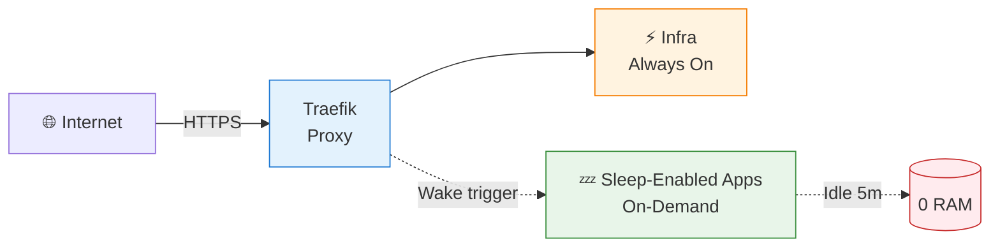
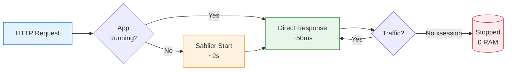

# Homelab

[](https://github.com/jakob1379/homelab/actions/workflows/test-docker-compose.yml)
[](https://docs.docker.com/compose/)
[](https://traefik.io/)
[](LICENSE)

> **Zero-config Docker Compose homelab.** Auto HTTPS. Smart resource management. Works on your laptop or production server.

**The pitch:** Automatic HTTPS, and sleep-enabled apps use 0 RAM when idle (they wake up in ~2 seconds on request, or via scheduled/queue triggers when configured).

---

## Try It Now (2 Minutes)

Run these commands to get a fully working homelab on your local machine:

```bash title="Local quick start"
# 1. Clone the repository
$ git clone https://github.com/jakob1379/homelab.git && cd homelab
Cloning into 'homelab'...
done.

# 2. Set up development environment (creates dummy secrets)
$ ./setup-dev.sh
[INFO] Setting up dummy files for homelab development...
[WARN] Creating dummy secret file: services/secrets/cf_dns_api_token
[WARN] Creating dummy environment file: services/.env-listmonk
...
[INFO] Setup complete!

# 3. Start everything
$ docker compose up -d
[+] Running ...
 ✔ Container homelab-traefik-1     Started
 ✔ Container homelab-immich-postgres-1 Started
 ✔ Container homelab-portainer-1   Started
 ...
```

```bash title="Verify the default whoami route"
# 4. Test it works (accept the self-signed certificate warning)
$ curl -k https://whoami.traefik.me
Hostname: homelab-whoami-1
IP: 172.20.0.2
```

✅ **Done!** Open `https://traefik.traefik.me` in your browser.

!!! note
    The `traefik.me` domain is a wildcard DNS that resolves to `127.0.0.1`. Perfect for local development without any DNS configuration.

---

## Architecture Overview



**What's happening here:**
- **Traefik** receives all HTTPS requests and routes them to the correct service
- **Infrastructure services** (traefik, sablier, rustfs, adguard) run continuously
- **Database containers are app-local** (`immich-postgres`, `listmonk-postgres`, `paperless-postgres`) instead of one shared database
- **Most applications** (portainer, paperless, etc.) start on-demand via **Sablier** when you access their URL, or via scheduled/queue triggers when configured
- **Immich API/UI** stays online for scheduler reliability; optional experimental profile can sleep/wake worker containers
- **Traefik removes host port publishing for almost all web apps**; in this stack only core networking services need host/network-level access

**What we mean by a stack:**
- A stack is the group of services needed to run one capability.
- Example: `immich-server` + `redis` + `immich-postgres` + Immich workers together are the **Immich stack**.
- We tune sleep/wake behavior per stack, not per random single container.

By default, host-level access is limited to:
- **Traefik** (`80/443`)
- **Portainer bootstrap** (`9443`)
- **AdGuard DNS** (`${ADGUARD_DNS_PORT}`)
- **NetAlertX** (`network_mode: host`)

If DNS is served through a VPN sidecar network (for example NetBird), AdGuard host DNS ports can be removed.

---

## App Lifecycle



**What's happening here:**
1. You visit `https://pods.traefik.me` (Portainer)
2. If **Portainer** is stopped, **Sablier** intercepts the request and starts the container (~2 seconds)
3. You see a "Starting..." page while the container boots
4. Once healthy, your request is proxied to the application
5. After the configured `sessionDuration` expires, **Sablier** stops the container to save resources. In this repo, those timeouts vary by route: **Immich workers** use `5m`, **Karakeep** uses `15m`, and most routed apps use `30m`.

---

## Quick Start (5 Minutes)

**Prerequisites:** Docker + Docker Compose v2+

```bash title="Quick start commands"
# 1. Clone & setup
$ git clone https://github.com/jakob1379/homelab.git && cd homelab
$ ./setup-dev.sh
[INFO] Setting up dummy files for homelab development...
[INFO] Setup complete!

# 2. Start everything (infra + apps)
$ docker compose up -d
[+] Running ...
 ✔ Container homelab-traefik-1    Started
 ✔ Container homelab-portainer-1  Started

# 3. Test (accept the self-signed cert warning)
$ curl -k https://whoami.traefik.me
Hostname: homelab-whoami-1
IP: 172.20.0.2
```

!!! note
    For local development, use `docker-compose.override.yml` to set `restart: unless-stopped` on all services. This prevents containers from restarting automatically after a reboot.

✅ **That's it!** Your homelab is running.

---

## What You Get

### Infrastructure (⚡ Always On)

| Service | Purpose | Access |
|---------|---------|--------|
| **Traefik** | Reverse proxy + auto HTTPS | `https://traefik.${DOMAIN}` |
| **Sablier** | Idle app management | Internal |
| **RustFS** | S3-compatible storage | `https://rustfs.${DOMAIN}` |
| **AdGuard** | DNS ad blocker | Port `${ADGUARD_DNS_PORT}` (default `1053`) + `https://dns.${DOMAIN}` |
| **NetAlertX** | Network scanner | `http://localhost:20211` |
| **whoami** | Debug endpoint | `https://whoami.${DOMAIN}` |
| **Dozzle** | Docker log viewer | `https://dozzle.${DOMAIN}` |

### Apps (Mostly 💤 On-Demand) - 13 apps

| Service | Purpose | Access |
|---------|---------|--------|
| **Homepage** | Service dashboard | `https://home.${DOMAIN}` |
| **AnythingLLM** | Private AI workspace | `https://llm.${DOMAIN}` |
| **Portainer** | Docker management | `https://pods.${DOMAIN}` |
| **Karakeep** | Bookmark manager | `https://keep.${DOMAIN}` |
| **Listmonk** | Newsletters | `https://listmonk.${DOMAIN}` |
| **Omni Tools** | General utilities | `https://omni.${DOMAIN}` |
| **Paperless-ngx** | Document management | `https://paperless.${DOMAIN}` |
| **IT Tools** | Dev utilities | `https://it.${DOMAIN}` |
| **CloudBeaver** | Database UI | `https://cbeaver.${DOMAIN}` |
| **BentoPDF** | PDF tools | `https://pdf.${DOMAIN}` |
| **Immich** | Photo management | `https://photos.${DOMAIN}` |
| **Jellyfin** | Media streaming | `https://jellyfin.${DOMAIN}` |
| **Seerr** | Media requests | `https://requests.${DOMAIN}` |

**First visit** to on-demand apps shows "Starting..." for ~2 seconds, then loads. **Immich** is routed by Traefik file-provider config at `https://photos.${DOMAIN}`.

For movie/series request automation (`Seerr` + `Radarr` + `Sonarr` + `qBittorrent`), set `OPENVPN_USER` and `OPENVPN_PASSWORD` in `.env` so Gluetun can establish the ProtonVPN tunnel.

### Smart Home (Standalone Stack)

**Home Assistant** runs as a separate compose project and joins `traefik_public`.

```bash title="Start the Home Assistant stack"
$ cd home-assistant
$ docker compose --profile service up -d
[+] Running 1/1
 ✔ Container home-assistant-ha-1  Started
```

Access: `https://ha.${DOMAIN}`

---

## Development vs Production

| | Development | Production |
|--|-------------|------------|
| **Domain** | `traefik.me` (magic DNS) | Your domain |
| **HTTPS** | Self-signed (browser warnings) | Let's Encrypt |
| **DNS** | None needed | NetBird DNS -> AdGuard wildcard + Cloudflare DNS-01 |
| **Setup** | `./setup-dev.sh` | Cloudflare token + AdGuard wildcard record |

**Development** (default, zero config):
```bash title="Development smoke test"
# Already works after Quick Start
$ curl -k https://whoami.traefik.me
Hostname: homelab-whoami-1
IP: 172.20.0.2
```

**Production** (your domain, valid certs):
```bash title="Production bootstrap values"
# 1. Set domain and Cloudflare email
$ printf 'DOMAIN=yourdomain.com\nCF_API_EMAIL=you@example.com\n' > .env

# 2. Add Cloudflare token
$ echo -n 'your_token' > services/secrets/cf_dns_api_token

# 3. Bootstrap Portainer only
$ docker compose --profile pods up -d

# 4. Open https://localhost:9443 and let Portainer deploy the full stack
```

See [Deployment Guide](docs/portainer.md) for the full bootstrap, DNS, TLS, and GitOps flow.

---

## Deployment Via Portainer

Deploy the stack through **Portainer**:

```bash title="Bootstrap Portainer and verify the local endpoint"
# 1. Bootstrap only Portainer + agent
$ docker compose --profile pods up -d
[+] Running 2/2
 ✔ Container homelab-agent-1      Started
 ✔ Container homelab-portainer-1  Started

# 2. Verify the direct bootstrap endpoint
$ curl -sk https://localhost:9443/api/status | jq '.Version'
"2.25.1"
```

Then:

1. Open `https://localhost:9443`
2. Create the Portainer admin user
3. Add this repo as a **Repository** stack
4. Let Portainer deploy **Traefik**, **AdGuard**, and the rest of the stack from Git

See [Deployment Guide](docs/portainer.md) for the full bootstrap, DNS, TLS, and GitOps flow.

---

## Common Commands

```bash title="Common Docker Compose commands"
# View all services
$ docker compose ps
NAME                IMAGE                STATUS
homelab-traefik-1   traefik:3.6.9        Up 2 hours (healthy)
homelab-listmonk-1  listmonk/listmonk:latest Up 2 hours

# View logs
$ docker compose logs -f traefik

# Stop everything
$ docker compose down

# Stop and remove data (⚠️ destructive)
$ docker compose down -v

# Restart a service
$ docker compose restart portainer
```

---

## Troubleshooting

### "Bad Gateway" or 502 Error

```bash title="Check a 502 or missing env file"
# Check service is running
$ docker compose ps | grep portainer
homelab-portainer-1   portainer/portainer-ce   Up 5 minutes

# Check logs
$ docker compose logs portainer --tail 20

# Common: Missing env file for a service that uses one
$ ls services/.env-listmonk
ls: cannot access 'services/.env-listmonk': No such file or directory
```

### Certificate Warning (Expected in Dev)

Click "Advanced" → "Proceed anyway" in browser, or use `curl -k`.

### Port 53 Conflict (AdGuard)

```bash title="Resolve an AdGuard port 53 conflict"
# Default dev value is ADGUARD_DNS_PORT=1053, so this only applies
# if you set ADGUARD_DNS_PORT=53.
# Find conflict
$ sudo lsof -i :53
systemd-r  1234 systemd-resolve   12u  IPv4 12345      0t0  UDP *:domain

# Fix: Disable systemd-resolved
$ sudo systemctl stop systemd-resolved
$ sudo systemctl disable systemd-resolved

# Or keep AdGuard on a non-conflicting port
$ echo "ADGUARD_DNS_PORT=1053" >> .env
```

### Sablier "Starting..." Forever

```bash title="Inspect a Sablier-managed service that will not wake"
# Check service health
$ docker compose ps portainer
NAME                STATUS
homelab-portainer-1 Restarting (1) 30 seconds ago

# Check logs for crash loop
$ docker compose logs portainer --tail 50

# Force start
$ docker compose up -d portainer
```

[More troubleshooting →](docs/troubleshooting.md)

---

## Configuration

### Environment Variables (`.env`)

| Variable | Required | Default | Description |
|----------|----------|---------|-------------|
| `DOMAIN` | No | `traefik.me` | Base domain |
| `CF_API_EMAIL` | For prod | — | Cloudflare email |
| `ADGUARD_DNS_PORT` | No | `1053` | Host DNS port mapped to AdGuard 53 |
| `OPENVPN_USER` | For media VPN | — | ProtonVPN OpenVPN username for Gluetun |
| `OPENVPN_PASSWORD` | For media VPN | — | ProtonVPN OpenVPN password for Gluetun |
| `VPN_SERVER_COUNTRIES` | No | `Netherlands` | Preferred VPN exit country for media downloads |

### Service Configs (`services/.env-*`)

| File | Service | Contents |
|------|---------|----------|
| `.env-listmonk` | Listmonk | DB credentials |
| `.env-karakeep` | Karakeep | Admin password, search key |
| `.env-rustfs` | RustFS | S3 keys |
| `.env-netalertx` | NetAlertX | Scan subnets |
| `.env-paperless` | Paperless-ngx | OCR language, secret key |
| `.env-bentopdf` | BentoPDF | PDF options |

### Secrets (`services/secrets/`)

| File | Used By | Purpose |
|------|---------|---------|
| `cf_dns_api_token` | Traefik | Cloudflare DNS |

---

## Documentation

- [Architecture & How It Works](docs/architecture.md) - Request flow, networks, Sablier mechanics
- [Deployment Guide](docs/portainer.md) - Bootstrap with `--profile pods`, deploy the full stack through Portainer, and follow the production DNS/TLS checklist
- [Queue-Driven Sleep Pattern](docs/queue-driven-sleep.md) - Sablier pattern for queue-backed workers (Immich)
- [Troubleshooting](docs/troubleshooting.md) - Common issues and fixes
- [Service Reference](docs/services.md) - Per-service configuration
- [Customization](docs/customization.md) - Adding services, backups, IP restrictions

---

## License

MIT License - See [LICENSE](LICENSE) file.

---

<p align="center">
  Built with <a href="https://traefik.io">Traefik</a> + <a href="https://sablierapp.dev">Sablier</a> + <a href="https://docker.com">Docker</a>
</p>
