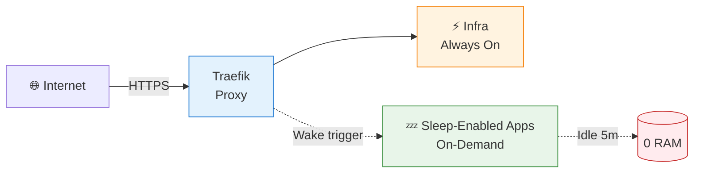
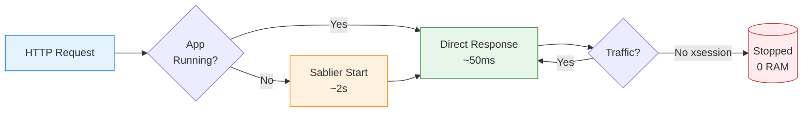

# Homelab

[](https://github.com/jakob1379/homelab/actions/workflows/test-docker-compose.yml)
[](https://docs.docker.com/compose/)
[](https://traefik.io/)
[](LICENSE)

> **Minimal-setup Docker Compose homelab.** Auto HTTPS. Smart resource management. Works on your laptop or production server.

**The pitch:** Automatic HTTPS, and sleep-enabled apps use 0 RAM when idle (they wake up in ~2 seconds on request, or via scheduled/queue triggers when configured).

---

## Try It Now (2 Minutes)

Run these commands to bootstrap the repo locally and see what values are still required:

```bash title="Local quick start"
# 1. Clone the repository
$ git clone https://github.com/jakob1379/homelab.git && cd homelab
Cloning into 'homelab'...
done.

# 2. Prepare the local env files and review missing secrets
$ ./setup-dev.sh
[INFO] Setting up the homelab development environment...
[INFO] setup-dev.sh leaves password-style credentials alone and only generates app keys
[INFO] Generated development key: NEXTAUTH_SECRET
[INFO] Generated development key: MEILI_MASTER_KEY
[WARN] Missing required variables for docker compose --profile all:
 - ACME_EMAIL
 - CF_DNS_API_TOKEN
 - ...
...
[INFO] Setup complete!

# 3. Fill the required values in .env / .envrc, then start the stacks
$ docker compose --profile all up -d
$ docker compose -f docker-compose.pods.yml up -d
[+] Running ...
  ✔ Container homelab-traefik-1     Started
  ✔ Container homelab-immich-postgres-1 Started
  ✔ Container homelab-pods-dockhand-1    Started
 ...
```

```bash title="Verify the default whoami route"
# 4. Test it works (accept the self-signed certificate warning)
$ curl -k https://whoami.traefik.me
Hostname: homelab-whoami-1
IP: 172.20.0.2
```

If you only want the bootstrap control plane first, start `docker-compose.pods.yml` and use `http://localhost:3000`.

!!! note
    The `traefik.me` domain is a wildcard DNS that resolves to `127.0.0.1`. Perfect for local development without any DNS configuration.

---

## Architecture Overview



**What's happening here:**
- **Traefik** receives all HTTPS requests and routes them to the correct service
- **Infrastructure services** (traefik, sablier, rustfs, adguard) run continuously
- **Database containers are app-local** (`immich-postgres`, `listmonk-postgres`, `paperless-postgres`) instead of one shared database
- **Most routed applications** (paperless, karakeep, listmonk, etc.) start on-demand via **Sablier** when you access their URL, or via scheduled/queue triggers when configured
- **Immich API/UI** stays online for scheduler reliability; optional experimental profile can sleep/wake worker containers
- **Traefik removes host port publishing for almost all web apps**; in this stack only core networking services need host/network-level access

**What we mean by a stack:**
- A stack is the group of services needed to run one capability.
- Example: `immich-server` + `redis` + `immich-postgres` + Immich workers together are the **Immich stack**.
- We tune sleep/wake behavior per stack, not per random single container.

By default, host-level access is limited to:
- **Traefik** (`80/443`)
- **Dockhand bootstrap** (`3000`)
- **AdGuard DNS** (`${ADGUARD_DNS_PORT}`)
- **NetAlertX** (`network_mode: host`)

If DNS is served through a VPN sidecar network (for example NetBird), AdGuard host DNS ports can be removed.

---

## App Lifecycle



**What's happening here:**
1. You visit `https://docker.traefik.me` (Dockhand)
2. If **Dockhand** is stopped, **Sablier** intercepts the request and starts the container (~2 seconds)
3. You see a "Starting..." page while the container boots
4. Once healthy, your request is proxied to the application
5. After the configured `sessionDuration` expires, **Sablier** stops the container to save resources. In this repo, those timeouts vary by route: **Immich workers** use `5m`, **Karakeep** uses `15m`, and most routed apps use `30m`.

---

## Quick Start (5 Minutes)

**Prerequisites:** Docker + Docker Compose v2+

```bash title="Quick start commands"
# 1. Clone & setup
$ git clone https://github.com/jakob1379/homelab.git && cd homelab
$ ./setup-dev.sh
[INFO] Setting up the homelab development environment...
[INFO] setup-dev.sh leaves password-style credentials alone and only generates app keys
[INFO] Setup complete!

# 2. Fill the required values in .env / .envrc, then start the stacks
$ docker compose --profile all up -d
$ docker compose -f docker-compose.pods.yml up -d
[+] Running ...
  ✔ Container homelab-traefik-1    Started
  ✔ Container homelab-pods-dockhand-1   Started

# 3. Test (accept the self-signed cert warning)
$ curl -k https://whoami.traefik.me
Hostname: homelab-whoami-1
IP: 172.20.0.2
```

!!! note
    Dockhand stays in the separate `docker-compose.pods.yml` bootstrap stack.

✅ **That's it!** Your homelab is running.

---

## What You Get

### Infrastructure (⚡ Always On)

| Service | Purpose | Access |
|---------|---------|--------|
| **Traefik** | Reverse proxy + auto HTTPS | `https://traefik.${DOMAIN}` |
| **Sablier** | Idle app management | Internal |
| **RustFS** | S3-compatible storage | `https://rustfs.${DOMAIN}` (UI), `https://rustfs-api.${DOMAIN}` (API) |
| **AdGuard** | DNS ad blocker | Port `${ADGUARD_DNS_PORT}` (default `1053`) + `https://dns.${DOMAIN}` |
| **NetAlertX** | Network scanner | `https://netalertx.${DOMAIN}` |
| **whoami** | Debug endpoint | `https://whoami.${DOMAIN}` |

### Apps (Mostly 💤 On-Demand) - 15 apps

| Service | Purpose | Access |
|---------|---------|--------|
| **Homepage** | Service dashboard | `https://home.${DOMAIN}` |
| **AnythingLLM** | Private AI workspace | `https://llm.${DOMAIN}` |
| **Dockhand** | Docker management | `https://docker.${DOMAIN}` |
| **Karakeep** | Bookmark manager | `https://keep.${DOMAIN}` |
| **Listmonk** | Newsletters | `https://listmonk.${DOMAIN}` |
| **Omni Tools** | General utilities | `https://omni.${DOMAIN}` |
| **Paperless-ngx** | Document management | `https://paper.${DOMAIN}` |
| **IT Tools** | Dev utilities | `https://it.${DOMAIN}` |
| **CloudBeaver** | Database UI | `https://cbeaver.${DOMAIN}` |
| **BentoPDF** | PDF tools | `https://pdf.${DOMAIN}` |
| **Speedtest Tracker** | Internet speed history | `https://speed.${DOMAIN}` |
| **VERT** | Local file converter | `https://vert.${DOMAIN}` |
| **Immich** | Photo management | `https://photos.${DOMAIN}` |
| **Jellyfin** | Media streaming | `https://jellyfin.${DOMAIN}` |
| **Seerr** | Media requests | `https://requests.${DOMAIN}` |

**First visit** to on-demand apps shows "Starting..." for ~2 seconds, then loads. **Immich** is routed by Traefik file-provider config at `https://photos.${DOMAIN}`.

For movie/series request automation (`Seerr` + `Radarr` + `Sonarr` + `qBittorrent`), set `OPENVPN_USER` and `OPENVPN_PASSWORD` in `.env` so Gluetun can establish the ProtonVPN tunnel. For local secret generation, the Nix dev shell includes `mkpasswd` and `openssl`.

### Smart Home (Standalone Stack)

**Home Assistant** runs as a separate compose project and joins `traefik_public`.

```bash title="Start the Home Assistant stack"
$ cd home-assistant
$ docker compose --profile service up -d
[+] Running 1/1
 ✔ Container home-assistant-ha-1  Started
```

Access: `https://ha.${DOMAIN}`

---

## Development vs Production

| | Development | Production |
|--|-------------|------------|
| **Domain** | `traefik.me` (magic DNS) | Your domain |
| **HTTPS** | Self-signed (browser warnings) | Let's Encrypt |
| **DNS** | None needed | NetBird DNS -> AdGuard wildcard + Cloudflare DNS-01 |
| **Setup** | `./setup-dev.sh` + fill required vars | ACME email + Cloudflare token + app secrets + AdGuard wildcard record |

**Development** (local placeholders for required secrets):
```bash title="Development smoke test"
# Already works after Quick Start
$ curl -k https://whoami.traefik.me
Hostname: homelab-whoami-1
IP: 172.20.0.2
```

**Production** (your domain, valid certs):
```bash title="Production bootstrap values"
# 1. Set domain, ACME email, and Cloudflare token
$ cat > .env <<'EOF'
DOMAIN=yourdomain.com
ACME_EMAIL=you@example.com
CF_DNS_API_TOKEN=your_token
EOF

# 2. Add the remaining app secrets or disable the apps you do not plan to run yet

# 3. Bootstrap Dockhand
$ docker compose -f docker-compose.pods.yml up -d

# 4. Open http://localhost:3000 to deploy the full stack
```

See [Deployment Guide](docs/dockhand.md) for the full bootstrap, DNS, TLS, and GitOps flow.

---

## Deployment Via Dockhand

Deploy the stack through **Dockhand**:

```bash title="Bootstrap Dockhand and verify the local endpoint"
# 1. Bootstrap Dockhand
$ docker compose -f docker-compose.pods.yml up -d
[+] Running 1/1
  ✔ Container homelab-pods-dockhand-1   Started

# 2. Verify the direct bootstrap endpoint
$ curl -I http://localhost:3000
HTTP/1.1 200 OK
```

Then:

1. Open `http://localhost:3000`
2. Add this repo as a Git-managed stack
4. Keep Dockhand on a matching host path such as `DOCKHAND_DATA_DIR=/opt/dockhand` if you plan to use it for Git stacks with relative bind mounts
5. Let Dockhand deploy **Traefik**, **AdGuard**, and the rest of the stack from Git

See [Deployment Guide](docs/dockhand.md) for the full bootstrap, DNS, TLS, and GitOps flow.

---

## Common Commands

```bash title="Common Docker Compose commands"
# View all services
$ docker compose ps
NAME                IMAGE                STATUS
homelab-traefik-1   traefik:3.6.9        Up 2 hours (healthy)
homelab-listmonk-1  listmonk/listmonk:v6.1.0 Up 2 hours

# View logs
$ docker compose logs -f traefik

# Stop everything
$ docker compose down

# Stop and remove data (⚠️ destructive)
$ docker compose down -v

# Restart a service
$ docker compose -f docker-compose.pods.yml restart dockhand
```

---

## Troubleshooting

### "Bad Gateway" or 502 Error

```bash title="Check a 502 or missing env file"
# Check service is running
$ docker compose -f docker-compose.pods.yml ps | grep dockhand
homelab-pods-dockhand-1   fnsys/dockhand:v1.0.24   Up 5 minutes

# Check logs
$ docker compose -f docker-compose.pods.yml logs dockhand --tail 20

# Common: Missing required variable for a service
$ docker compose --profile all config
required variable LISTMONK_db__password is missing a value: Set LISTMONK_db__password in .env, direnv, or Dockhand
```

### Certificate Warning (Expected in Dev)

Click "Advanced" → "Proceed anyway" in browser, or use `curl -k`.

### Port 53 Conflict (AdGuard)

```bash title="Resolve an AdGuard port 53 conflict"
# Default dev value is ADGUARD_DNS_PORT=1053, so this only applies
# if you set ADGUARD_DNS_PORT=53.
# Find conflict
$ sudo lsof -i :53
systemd-r  1234 systemd-resolve   12u  IPv4 12345      0t0  UDP *:domain

# Fix: Disable systemd-resolved
$ sudo systemctl stop systemd-resolved
$ sudo systemctl disable systemd-resolved

# Or keep AdGuard on a non-conflicting port
$ echo "ADGUARD_DNS_PORT=1053" >> .env
```

### Sablier "Starting..." Forever

```bash title="Inspect a Sablier-managed service that will not wake"
# Check service health
$ docker compose -f docker-compose.pods.yml ps dockhand
NAME                STATUS
homelab-pods-dockhand-1 Restarting (1) 30 seconds ago

# Check logs for crash loop
$ docker compose -f docker-compose.pods.yml logs dockhand --tail 50

# Force start
$ docker compose -f docker-compose.pods.yml up -d dockhand
```

[More troubleshooting →](docs/troubleshooting.md)

---

## Configuration

### Environment Variables (`.env`)

| Variable | Required | Default | Description |
|----------|----------|---------|-------------|
| `DOMAIN` | No | `traefik.me` | Base domain |
| `ACME_EMAIL` | Yes | — | Let's Encrypt ACME contact email for Traefik |
| `CF_DNS_API_TOKEN` | Yes | — | Cloudflare DNS API token for DNS-01 |
| `ADGUARD_DNS_PORT` | No | `1053` | Host DNS port mapped to AdGuard 53 |
| `IMMICH_DB_PASSWORD` | Yes | — | Immich PostgreSQL password |
| `LISTMONK_db__password` | Yes | — | Listmonk PostgreSQL password |
| `PAPERLESS_DBPASS` | Yes | — | Paperless PostgreSQL password |
| `PAPERLESS_ADMIN_PASSWORD` | Yes | — | Paperless initial admin password |
| `PAPERLESS_SECRET_KEY` | Yes | — | Paperless app secret key |
| `NEXTAUTH_SECRET` | Yes | — | Karakeep auth secret |
| `MEILI_MASTER_KEY` | Yes | — | Karakeep / Meilisearch shared key |
| `KARAKEEP_OPENAI_API_KEY` | No | — | Optional Karakeep OpenAI API key exposed to the container as `OPENAI_API_KEY` |
| `KARAKEEP_OAUTH_WELLKNOWN_URL` | No | — | Optional Karakeep OIDC discovery URL |
| `KARAKEEP_OAUTH_CLIENT_ID` | No | — | Optional Karakeep OIDC client ID |
| `KARAKEEP_OAUTH_CLIENT_SECRET` | No | — | Optional Karakeep OIDC client secret |
| `KARAKEEP_OAUTH_PROVIDER_NAME` | No | `OIDC` | Optional Karakeep provider label shown in the sign-in UI |
| `RUSTFS_ACCESS_KEY` | Yes | — | RustFS S3 access key |
| `RUSTFS_SECRET_KEY` | Yes | — | RustFS S3 secret key |
| `OPENVPN_USER` | For media VPN | — | ProtonVPN OpenVPN username for Gluetun |
| `OPENVPN_PASSWORD` | For media VPN | — | ProtonVPN OpenVPN password for Gluetun |
| `VPN_SERVER_COUNTRIES` | No | `Netherlands` | Preferred VPN exit country for media downloads |
| `SPEEDTEST_APP_KEY` | Yes for Speedtest Tracker | — | Speedtest Tracker Laravel app key |

### Service Defaults and Secrets

Safe defaults now live in the compose files.
Required secrets should be set through `.env`, `.envrc`, or Dockhand instead of repo-managed `services/.env-*` files.
For local development, `setup-dev.sh` generates base64 app keys for `PAPERLESS_SECRET_KEY`, `NEXTAUTH_SECRET`, `MEILI_MASTER_KEY`, and `SPEEDTEST_APP_KEY` when they are missing.
Karakeep OIDC stays off by default. Leave the optional Karakeep OIDC variables unset for development, and set them only when you want to add an OIDC sign-in option alongside the default password flow.
If you use the Nix dev shell, `mkpasswd` is available for passwords and `openssl` is available for hex/base64 secrets.

### TLS / DNS Credentials

| Variable | Used By | Purpose |
|----------|---------|---------|
| `ACME_EMAIL` | Traefik | Let's Encrypt ACME contact email |
| `CF_DNS_API_TOKEN` | Traefik | Cloudflare DNS-01 challenge token |

---

## Documentation

- [Architecture & How It Works](docs/architecture.md) - Request flow, networks, Sablier mechanics
- [Deployment Guide](docs/dockhand.md) - Bootstrap with `docker-compose.pods.yml`, deploy the main stack through Dockhand, and follow the production DNS/TLS checklist
- [Queue-Driven Sleep Pattern](docs/queue-driven-sleep.md) - Sablier pattern for queue-backed workers (Immich)
- [Troubleshooting](docs/troubleshooting.md) - Common issues and fixes
- [Service Reference](docs/services.md) - Per-service configuration
- [Customization](docs/customization.md) - Adding services, backups, IP restrictions

---

## License

MIT License - See [LICENSE](LICENSE) file.

---

<p align="center">
  Built with <a href="https://traefik.io">Traefik</a> + <a href="https://sablierapp.dev">Sablier</a> + <a href="https://docker.com">Docker</a>
</p>
