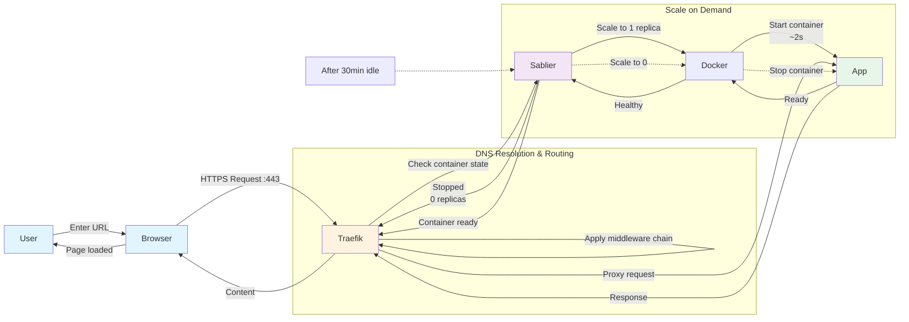
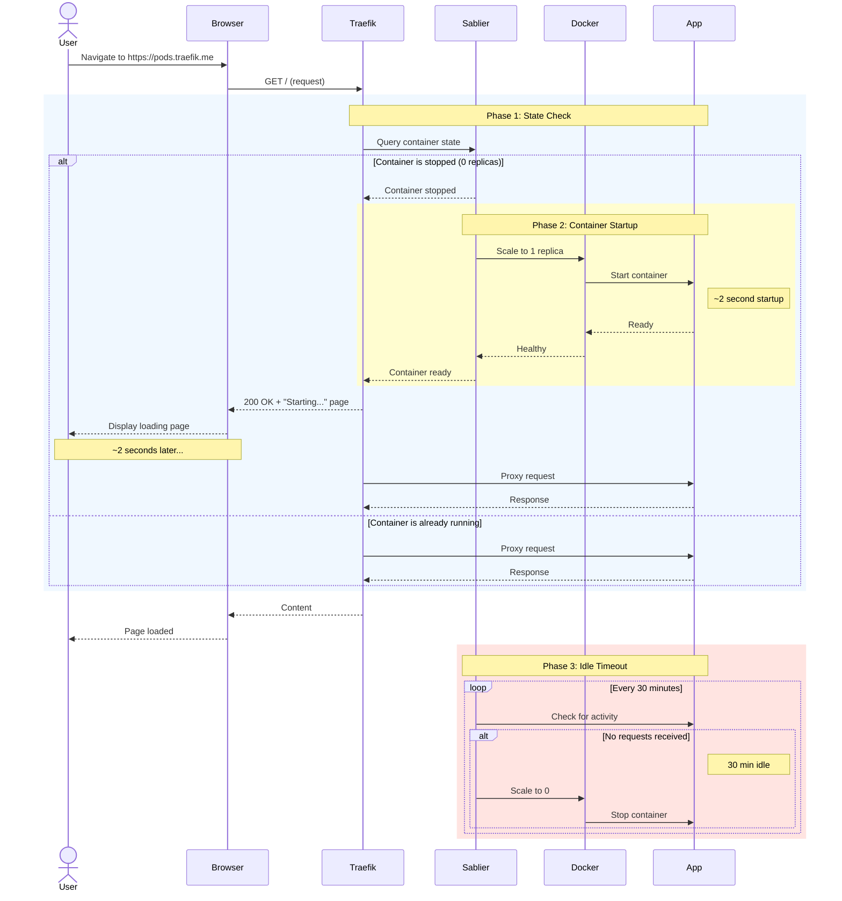

# Homelab Architecture

This page explains how requests flow from your browser to your containers, how service stacks are organized, and how sleep-on-demand works. Read this before editing [services](services.md), [customization](customization.md), [Portainer](portainer.md), or [production](production.md).

---

## Try It Now

Explore your running system with these commands:

```bash
# Check that services are healthy
$ docker compose ps
NAME                IMAGE                STATUS
homelab-traefik-1   traefik:3.6.9        Up 2 hours (healthy)
homelab-rustfs-1    rustfs/rustfs:latest Up 2 hours (healthy)
```

```bash
# View the Traefik dashboard API
$ curl -s https://traefik.traefik.me/api/version | jq
{
  "version": "3.0.0"
}
```

```bash
# List configured routers
$ curl -s https://traefik.traefik.me/api/http/routers | jq -r '.[].name'
immich@file
portainer@file
homepage@file
...
```

## What We Mean By "Stack"

A **stack** is a set of services that run together to deliver one capability.

Examples from this repo:

- **Immich stack:** `immich-server`, `immich-microservices`, `immich-machine-learning`, `redis`, `immich-postgres`
- **Paperless stack:** `paperless-web`, `paperless-consumer`, `paperless-redis`, `paperless-postgres`, `paperless-gotenberg`, `paperless-tika`
- **Media stack:** `jellyfin`, `seerr`, `gluetun`, `qbittorrent`, `sonarr`, `radarr`

This is the core mental model for the docs:

- We design, document, and tune services as stacks.
- We decide sleep/wake behavior per stack, not per random container.
- We keep stateful dependencies (DB/queue) in the same stack definition so startup behavior stays
  predictable.

---

## Request Flow



**What's happening here:**

When you type `https://pods.traefik.me` in your browser:

1. **DNS Resolution**: Your browser looks up `pods.traefik.me` → gets your server's IP (or
   `127.0.0.1` in dev)
2. **HTTPS Handshake**: **Traefik** terminates TLS using its auto-generated certificate
3. **Router Matching**: **Traefik** reads the `Host` header (`pods.traefik.me`) and finds the
   matching router rule
4. **Middleware Chain**: **Sablier** middleware intercepts the request for sleep-enabled routes
5. **State Check**: If the container is stopped, **Sablier** scales it to 1 replica via Docker API
6. **Startup Delay**: Container boots (~2 seconds), then passes health check
7. **Proxy**: **Traefik** forwards your request to the now-running container
8. **Response**: Container replies, **Traefik** sends it back to your browser

The inline code for this flow:

```yaml
# Traefik router matches the Host header
rule: Host(`pods.${DOMAIN}`)

# Sablier middleware checks container state
middlewares:
  - sablier-portainer@file

# Docker Compose labels enable Sablier
labels:
  - sablier.enable=true
  - sablier.group=portainer
```

---

## Directory Structure

Remember your first `docker-compose.yml` that grew to 300 lines and became impossible to read? We've been there. Instead of one giant file, it's easier to manage when we split services into separate files by purpose: networking stuff in one place, apps in another, databases somewhere else.

Think of it like organizing your tools: dumping everything in one drawer works, but finding the
screwdriver is much easier when you have a dedicated toolbox.

### Structure Overview

=== "Entry Point"

    ```
    .
    ├── docker-compose.yml      # Main compose - includes all services/*.yml
    ├── setup-dev.sh            # One-time development environment setup
    └── zensical.toml           # Documentation site configuration
    ```

    **What's happening here:**
    The main `docker-compose.yml` uses an `include:` directive to pull in service definitions. This keeps the root file clean while each service evolves independently.

    ```yaml
    # docker-compose.yml
    include:
      - services/networking.yml  # Traefik, Sablier, AdGuard
      - services/portainer.yml   # Docker management
    ```

=== "Services"

    ```
    services/
    ├── secrets/                # Docker secrets (excluded from git)
    │   └── cf_dns_api_token
    ├── homepage.yml            # Dashboard/landing page
    ├── immich.yml              # Photo management
    ├── karakeep.yml            # Bookmark manager
    ├── listmonk.yml            # Newsletter/mailing lists
    ├── media.yml               # Jellyfin + Seerr + media automation
    ├── monitoring.yml          # Dozzle (log viewer)
    ├── networking.yml          # Traefik, AdGuard, NetAlertX
    ├── omni-tools.yml          # Web-based utilities
    ├── paperless-ngx.yml       # Document management
    ├── portainer.yml           # Docker management UI
    ├── rustfs.yml              # S3-compatible object storage
    └── tools.yml               # IT Tools, CloudBeaver, BentoPDF
    ```

    **What's happening here:**
    Each file defines a complete stack (volumes, networks, environment). The `secrets/` subdirectory holds sensitive values as plain files, never committed to git.

    ```bash
    # Create a dummy secret for development
    $ echo -n "dummy_token" > services/secrets/cf_dns_api_token
    ```

=== "Routes"

    ```
    traefik-config/
    └── traefik/
        ├── dyn/                # Dynamic router configurations
        │   ├── common.yml      # Shared middlewares (auth, headers, Sablier)
        │   ├── bentopdf.yml    # Per-service routing rules
        │   ├── immich.yml
        │   ├── portainer.yml
        │   └── ...             # One file per external service
        └── traefik.yml         # Static Traefik configuration
    ```

    **What's happening here:**
    Dynamic configs in `dyn/` are hot-reloaded by **Traefik**—no restart needed when adding routes. This separation means you can modify proxy behavior without touching service definitions.

    ```yaml
    # traefik-config/traefik/dyn/immich.yml
    http:
      routers:
        immich:
          rule: 'Host(`photos.{{ env "DOMAIN" }}`)'
          service: immich
          middlewares: [startup-retry@file]
    ```

=== "Standalone"

    ```
    home-assistant/
    └── docker-compose.yml      # Separate compose stack (uses named volume ha_config for /config)
    ```

    **What's happening here:**
    **Home Assistant** runs as its own compose project but attaches to the shared `traefik_public` network. This pattern lets us add complex, stateful services without cluttering the main homelab files. As a rule of thumb, if a stack needs more than a `.env` file, move it to its own folder at the repo root.

## Traefik Labels vs Static Config vs Dynamic Config

Traefik configuration comes from three places in this repo, each with a different job.

| Location | Purpose | Typical content |
|---|---|---|
| `traefik-config/traefik/traefik.yml` | Static bootstrap config | EntryPoints, providers, ACME resolver, plugin loading |
| `traefik-config/traefik/dyn/*.yml` | Dynamic routing behavior | Routers, services, middlewares (including Sablier middleware) |
| Service labels in `services/*.yml` | Service metadata and discovery hints | `traefik.enable=true`, homepage labels, optional `sablier.*` group labels |

How we use them:

- We keep routing logic in dynamic files (`dyn/*.yml`) so it stays explicit and reviewable.
- We use labels for discovery/exposure metadata, not complex router chains.
- We treat static config as platform-level behavior and change it rarely.

Practical rule:

- If you are changing **how traffic is routed**, edit `traefik-config/traefik/dyn/*.yml`.
- If you are changing **Traefik platform behavior**, edit `traefik-config/traefik/traefik.yml`.
- If you are adding a service and want Traefik to discover it, add `traefik.enable=true` in service labels.

---

## Profile Separation

Here's a common problem: run `docker compose up` on this stack and it starts 15+ containers at once, even when you're just testing **Traefik**. That's like starting your entire computer just to check email.

**Docker Compose profiles** are a great solution: they're tags that say "start these services together." They let us group services into `infra` (the stuff that should always run) and `apps` (the stuff that can sleep until you need it).

### The Problem

Running everything at once wastes resources, since each idle container still consumes RAM and CPU:

```bash
$ docker compose up -d  # Starts everything
$ docker stats --no-stream | awk 'NR>1 {sum+=$3} END {print "Total CPU: " sum"%"}'
Total CPU: 23%
```

### The Solution

This homelab uses **three profiles** to control what starts when:

| Profile        | Purpose                            | When to Use                      |
|----------------|------------------------------------|----------------------------------|
| `infra`        | Always-on foundation services      | Run this first, leave it running |
| `apps`         | On-demand applications             | Start only when needed           |
| `all`          | Convenience profile                | Development or full testing      |
| `experimental` | Things that most likely will break | Development only                 |

**Infra services** (always running) include **Traefik**, **Sablier**, **RustFS**, and **AdGuard**. Stateful apps run app-local databases (`immich-postgres`, `listmonk-postgres`, `paperless-postgres`) in the `apps` profile.

**Most app services** start on-demand via **Sablier** when you access them. You can also wake groups via cron pre-warm or queue-monitor triggers where needed. **Immich API/UI** is the exception and stays online by default; only its worker wake flow is optional via the `experimental` profile.

For queue-backed workloads, use the dedicated [Queue-Driven Sleep Pattern](queue-driven-sleep.md).

### Start Only Infrastructure

Run the foundation services without any apps:

```bash
$ docker compose --profile infra up -d
[+] Running 6/6
 ✔ Container traefik    Started
 ✔ Container adguard    Started
 ✔ Container rustfs     Started
```

Verify only infra services are running:

```bash
$ docker compose ps --services
rustfs
traefik
sablier
adguard
whoami
```

### Add Specific Apps

Start individual apps on top of the running infra:

```bash
$ docker compose --profile infra up -d  # Foundation already running
$ docker compose --profile apps up -d portainer ittools
[+] Running 2/2
 ✔ Container portainer  Started
 ✔ Container ittools    Started
```

### Use the Convenience Profile

For development or when you want everything (not including *experimental*):

```bash
$ export COMPOSE_PROFILES=all
$ docker compose up -d  # Starts both infra and apps
```

Or in your `.env` file:

```bash
COMPOSE_PROFILES=all
```

### Check What's Running

List services by profile:

```bash
$ docker compose ps --services --filter "profile=infra"
rustfs
traefik

$ docker compose ps --services --filter "profile=apps"
portainer
ittools
```

### Profile Strategy in Practice

1. **Production servers**: Set `COMPOSE_PROFILES=infra` and let **Sablier** start sleep-enabled apps on-demand
2. **Development machines**: Use `COMPOSE_PROFILES=all` for immediate access to everything
3. **CI/CD pipelines**: Test each profile independently to validate service boundaries

The separation keeps your baseline resource usage low while giving you access to the full stack when needed.

---

## Networks

| Network           | Purpose                    | Services                                                          |
|-------------------|----------------------------|-------------------------------------------------------------------|
| `traefik_public`  | External proxy access      | All web-facing services                                           |
| `listmonk`        | Listmonk isolation         | listmonk, listmonk-postgres, cftunnel (optional `tunnel` profile) |
| `keep`            | Karakeep isolation         | keep, chrome, meilisearch                                         |
| `portainer_agent` | Portainer control          | portainer, agent                                                  |
| `immich`          | Immich internals           | immich-server, workers, redis, immich-postgres                    |
| `paperless`       | Paperless internals        | paperless services + paperless-postgres                           |
| `media`           | Media automation internals | jellyfin, seerr, gluetun, qbittorrent, sonarr, radarr             |

**What's happening here:**

**Traefik** and all web-facing services connect to `traefik_public`. This is the only network that bridges to the outside world. Other networks isolate service groups for security:

```yaml
# services/karakeep.yml
services:
  keep:
    networks: [traefik_public, keep]  # External + internal
  chrome:
    networks: [keep]                   # Internal only
  meilisearch:
    networks: [keep]                   # Internal only
```

The **Karakeep** web UI needs `traefik_public` to receive traffic, but **Chrome** and **Meilisearch** only need to talk to **Karakeep**—they don't need external access.

This is also why we publish very few host ports. For proxied web apps, Traefik handles ingress, so app services usually expose no host ports at all.

In this stack, host/network-level access is limited to core networking pieces:

- `traefik` (`80/443`, plus `8080` dashboard)
- `adguard` DNS port mapping
- `netalertx` with `network_mode: host`

If DNS is provided through a VPN sidecar network (for example NetBird), the AdGuard DNS host port mapping can be removed.

---

## Certificate Management

| Environment | Certificate Source | Validation Method |
|-------------|-------------------|-------------------|
| **Development** | **Traefik** self-signed | None (local only) |
| **Production** | **Let's Encrypt** | **Cloudflare** DNS-01 challenge |

**What's happening here:**

DNS challenge enables wildcard certificates (`*.yourdomain.com`). Instead of requesting a certificate for each subdomain individually, you get one certificate that covers everything.

```yaml
# traefik-config/traefik/traefik.yml
certificatesResolvers:
  cfresolver:
    acme:
      dnsChallenge:
        provider: cloudflare
```

**Traefik** is configured to use the **Cloudflare** API token (from
`services/secrets/cf_dns_api_token`) to automatically add TXT to your DNS records, proving domain
ownership.

---

## Why Your Apps Can Sleep (and Why That's Good)

Here's the thing about self-hosting: most of your apps sit idle 90% of the time. You're not
uploading photos at 3 AM. You're not generating PDFs while you're asleep. But traditional Docker
keeps those containers running 24/7, hogging resources for no reason.

**Sablier** is our "smart receptionist." When you visit `pods.yourdomain.com`, it checks if
**Portainer** is awake. If not, it puts you in a waiting room while it starts the container. When
you're done and 30 minutes pass with no activity, it puts the app back to sleep. Your server thanks
you.

### How It Works



**What's happening here:**

The sequence diagram shows the three phases:

1. **State Check (Blue)**: **Traefik** asks **Sablier** if the container is running
2. **Startup (Yellow)**: If stopped, **Sablier** scales to 1 replica via Docker API, waits for health check
3. **Idle Timeout (Red)**: Every 30 minutes, **Sablier** checks for activity; if none, scales to 0

The inline code that enables this:

```yaml
# traefik-config/traefik/dyn/portainer.yml
http:
  middlewares:
    sablier-portainer:
      plugin:
        sablier:
          group: portainer
          sablierUrl: http://sablier:10000
          sessionDuration: 30m
```

### The Magic Behind Automatic URLs

Labels are how containers send notes to **Traefik** and **Sablier**. You know how Docker containers
are isolated by default? They can't see each other unless you connect them to the same
network. Labels are like sticky notes you put on the container that say "hey **Traefik**, route
traffic to me" or "hey **Sablier**, you can put me to sleep when I'm idle."

This setup has evolved over time. In the beginning, every service needed at least five Traefik labels.
That got repetitive quickly. Most of those labels can be generated from sensible defaults, so instead
of manually writing URLs for every service, we use one line in **Traefik's** config that generates
them automatically:

```yaml
# traefik-config/traefik/traefik.yml
defaultRule: "Host(`{{ index .Labels \"com.docker.compose.service\" | default .Name }}.{{ env \"DOMAIN\" }}`)"
```

**What's happening here?**

Think of it like a mail sorting system. When **Traefik** sees a new container, it reads the label
`com.docker.compose.service` (which **Docker Compose** sets automatically). If your service is named
`myapp`, **Traefik** can route `myapp.yourdomain.com` to that container without manual router
labels.

**The Template Breakdown:**

| Part                                         | Plain English                                                     |
|----------------------------------------------|-------------------------------------------------------------------|
| `{{ ... }}`                                  | Go template syntax: **Traefik** evaluates this for each container |
| `index .Labels "com.docker.compose.service"` | "Read the service name from the container's labels"               |
| `\| default .Name`                           | "If that label doesn't exist, use the container name instead"     |
| `.{{ env "DOMAIN" }}`                        | "Add the domain from Traefik's `DOMAIN` environment variable"     |

**Why This Saves You Work:**

Without `defaultRule`, every service needs four labels just to get a URL:

```yaml
labels:
  - traefik.enable=true
  - traefik.http.routers.myapp.rule=Host(`myapp.yourdomain.com`)
  - traefik.http.routers.myapp.tls=true
  - traefik.http.routers.myapp.entrypoints=websecure
```

With `defaultRule`, the minimum label for exposure is:

```yaml
labels:
  - traefik.enable=true        # Required: expose this container to Traefik
```

That is enough for URL generation. `https://myapp.yourdomain.com` is generated automatically from the service name.

For sleep-on-request behavior in this repo, add a Sablier middleware to the router (usually in `traefik-config/traefik/dyn/*.yml`) and keep `sablier.enable=true` on the service so Sablier can manage it.

```yaml
# traefik-config/traefik/dyn/myapp.yml
http:
  routers:
    myapp:
      rule: Host(`myapp.${DOMAIN}`)
      middlewares: [sablier-myapp@file]
```

**Current Homelab Example (explicit override):**

Looking at `services/networking.yml`, `whoami` sets an explicit host rule instead of relying on `defaultRule`:

```yaml
services:
  whoami:
    labels:
      - traefik.enable=true
      - traefik.http.routers.whoami.rule=Host(`whoami.${DOMAIN:-traefik.me}`)
      - sablier.enable=true
```

That override keeps the URL stable and human-friendly.

**When to Override:**

Sometimes you want a cleaner URL than the service name. Override per-service:

```yaml
labels:
  - traefik.enable=true
  - traefik.http.routers.myapp.rule=Host(`photos.yourdomain.com`)  # Custom URL
```

Common reasons to override:
- Shorter URLs (`photos` vs `myapp`)
- Multiple domains pointing to same service
- Path-based routing (`yourdomain.com/immich`)
- Complex rules with multiple hostnames or path prefixes

### Session Flow

1. **Idle**: Container at 0 replicas (0 RAM usage)
2. **HTTP Request**: **Sablier** intercepts and scales container to 1
3. **Loading Page**: User sees "Starting..." while container boots (~2 seconds)
4. **Ready**: Container passes healthcheck, request is proxied
5. **Timeout**: After 30 minutes of no requests, scales back to 0

Session duration is configurable per service via `sessionDuration` in middleware config.
