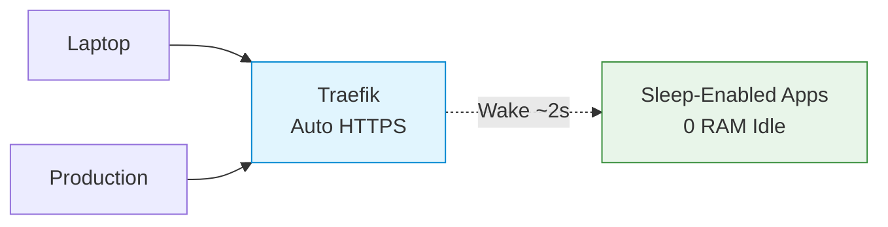

<p align="center">
  <strong style="font-size: 1.5em;">Zero-config Docker Compose homelab</strong><br>
  <span style="opacity: 0.7;">Auto HTTPS &middot; Services scale to 0</span>
</p>

---


# What You'll Find Here

<div class="grid cards" markdown>

-   🖥️ **Architecture**

    ---

    How it all works under the hood: Traefik routing, Sablier magic, and network topology.

    [→ Learn the internals](architecture.md)

-   📦 **Services**

    ---

    Complete reference for all services, their URLs, and configuration.

    [→ Browse services](services.md)

-   🛠️ **Customization**

    ---

    Add your own services, configure backups, set up IP restrictions.

    [→ Make it yours](customization.md)

-   🔁 **Queue-Driven Sleep**

    ---

    Use Sablier with queue-backed workers (Immich pattern) without breaking background jobs.

    [→ See the pattern](queue-driven-sleep.md)

-   ⚠️ **Troubleshooting**

    ---

    Stuck? Common issues and step-by-step fixes.

    [→ Get unstuck](troubleshooting.md)

-   🐳 **Deployment**

    ---

    Bootstrap with `--profile pods`, then let Portainer deploy Traefik, AdGuard, and the rest of the stack from Git, including the production DNS and TLS checklist.

    [→ Deploy the stack](portainer.md)

</div>

---

!!! info "Quick Start: Get Running in 30 Seconds"

    **Prerequisites:** Docker + Docker Compose v2+

    ```bash
    # Clone & configure
    $ git clone https://github.com/jakob1379/homelab.git && cd homelab
    Cloning into 'homelab'...
    done.

    $ ./setup-dev.sh
    [INFO] Setting up dummy files for homelab development...
    [INFO] Setup complete!

    # Start infrastructure + apps
    $ docker compose up -d
    [+] Running ...
     ✔ Container homelab-traefik-1  Started
     ✔ Container homelab-whoami-1   Started

    # Verify (accept self-signed cert warning)
    $ curl -k https://whoami.traefik.me
    Hostname: homelab-whoami-1
    ```

    **Done!** Your homelab is running locally - check it out at https://traefik.traefik.me.

    For the GitOps deployment path, use [Deployment](portainer.md) instead of starting `infra` manually.

---

## The Pitch

**Containerized services** with automatic HTTPS. Sleep-enabled apps use 0 RAM when idle (they wake up in ~2 seconds on request, or via scheduled/queue triggers when configured). Works on your laptop with zero config, or in production with your own domain.



---

<p align="center" style="opacity: 0.7;">
  Built with ❤️ using
  <a href="https://traefik.io">Traefik</a>,
  <a href="https://sablierapp.dev">Sablier</a>, and
  <a href="https://docker.com">Docker</a>
</p>
